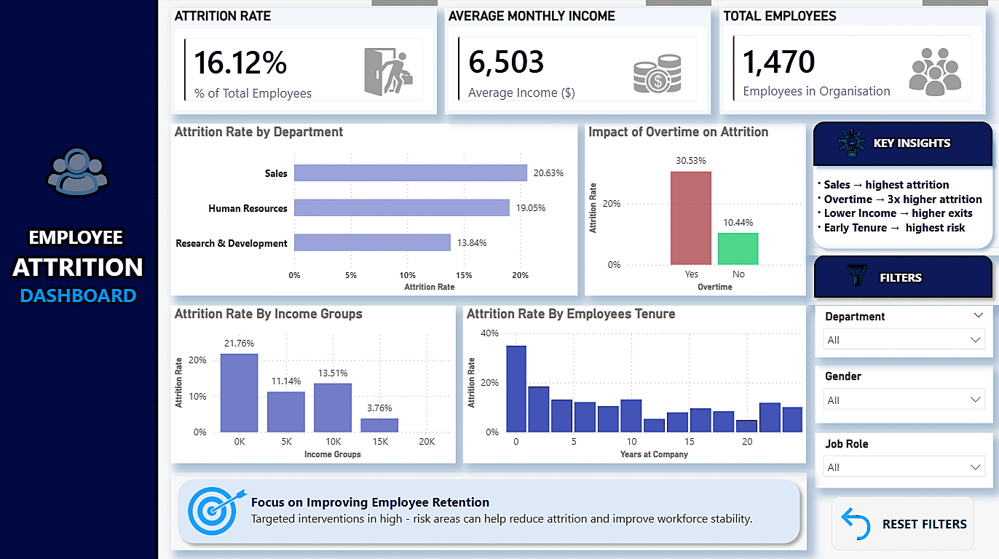

# 📊 Employee Attrition Analysis

> Why are employees leaving… and what can we actually do about it?

---

## 🧠 The Problem
Employee attrition isn’t random — it’s driven by patterns.  
This project explores HR data to uncover **key drivers behind employee turnover.**

---

## ⚙️ What I Did
- Cleaned and explored the dataset
- Performed analysis using SQL
- Built an interactive Power BI dashboard

---

## 🔍 Key Insights

🔥 Sales has the highest attrition (~20%)  
⏱ Overtime employees are ~3x more likely to leave  
💸 Lower income groups show higher attrition  
📉 Early tenure (0–2 years) = highest risk  

---

## 📊 Dashboard Features
- Interactive filters (Department, Gender, Job Role)
- Attrition breakdown by:
  - Department
  - Overtime
  - Income groups
  - Tenure

---

## 🛠 Tech Stack
- Power BI  
- SQL  
- Excel  

---

## 📸 Dashboard Preview

[Download Power BI Dashboard](dashboard/HR%20Attrition%20Dashboard.pbix)

---

## 💡 Final Thought
Attrition isn’t just an HR metric —  
it’s a **business problem you can solve with data.**
